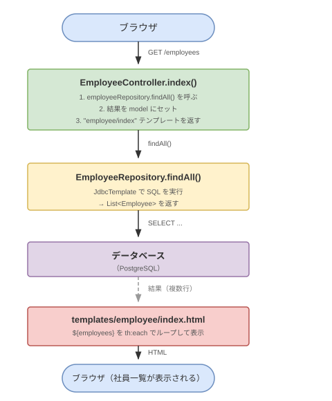
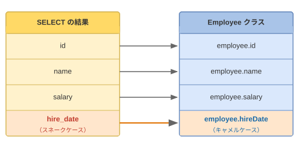

# ch01 一覧表示

## このチャプターで学ぶこと

- Controller → Repository → View のデータの流れ
- アノテーション（`@Controller`・`@GetMapping`）の役割
- `JdbcTemplate` で SELECT を実行し、結果を画面に渡す方法
- Thymeleaf の `th:each`・`th:text`・`th:href` でリストを表示する方法

---

## 基礎知識

### Controller → Repository → View のデータの流れ

ブラウザが `GET /employees` にアクセスしたとき、内部では次の流れが起きます。



### アノテーション

アノテーションとは、クラスやメソッドに付ける「印」です。Spring はこの印を見て、どのクラスが Controller か・どのメソッドがどの URL を担当するかを判断します。

| アノテーション | 役割 |
|---|---|
| `@Controller` | このクラスが MVC の Controller であることを Spring に伝える |
| `@RequestMapping("/employees")` | このクラス全体が `/employees` 以下の URL を担当することを指定する |
| `@GetMapping` | `GET /employees` へのリクエストをこのメソッドが処理する |

```java
// controller/EmployeeController.java

@Controller                           // ← Controller として登録
@RequestMapping("/employees")         // ← /employees 以下を担当
public class EmployeeController {

    @GetMapping                       // ← GET /employees を処理
    public String index(Model model) {
        // ...
    }
}
```

### Model でデータを View に渡す

`Model` は Controller から View（テンプレート）へデータを渡す入れ物です。  
`model.addAttribute("キー名", 値)` で登録した値は、テンプレート内で `${キー名}` として参照できます。

```java
// Controller
model.addAttribute("employees", employees);
```

```html
<!-- テンプレート -->
<td th:text="${employees}">...</td>
```

### Thymeleaf の基本属性

Thymeleaf は `th:` で始まる属性を使って HTML にデータを埋め込みます。

#### th:each ─ コレクションを繰り返し表示する

tokkun-java で学んだ **for-each ループ** と同じ考え方です。

```html
<!-- employees の件数だけ <tr> を繰り返す -->
<tr th:each="employee : ${employees}">
    <td th:text="${employee.id}"></td>
    <td th:text="${employee.name}"></td>
</tr>
```

Java で書くと：

```java
for (Employee employee : employees) {
    // employee.getId() → 画面の <td> に表示
}
```

#### th:text ─ タグの中身を変数で置き換える

```html
<td th:text="${employee.name}">ここの文字は実行時に置き換えられる</td>
```

#### th:href ─ リンク先 URL を動的に生成する

```html
<!-- /employees/3 のように id を URL に埋め込む -->
<a th:href="@{/employees/{id}(id=${employee.id})}">詳細</a>
```

`@{...}` は Thymeleaf の URL 表現です。`{id}` がプレースホルダで、`(id=${employee.id})` の値で置き換えられます。

### Repository と JdbcTemplate

Repository は SQL を実行する専用クラスです。Controller は Repository を呼ぶだけで、直接 SQL を書きません。

```java
// repository/EmployeeRepository.java

public List<Employee> findAll() {
    return jdbcTemplate.query(
        "SELECT id, name FROM employees ORDER BY id",  // ← tokkun-sql で書いた SQL と同じ
        Map.of(),
        new BeanPropertyRowMapper<>(Employee.class)    // ← 行を Employee オブジェクトに変換
    );
}
```

`BeanPropertyRowMapper` は、SELECT で取得した列名を Employee クラスのフィールドに自動でマッピングします。



> **ポイント**: SQL の列名 `hire_date`（スネークケース）は Java の `hireDate`（キャメルケース）に自動変換されます。

---

## スターターコードの確認

現在の状態を確認しましょう。

**動いていること**
- `GET /employees` で社員一覧が表示される
- 表示されるのは「ID」と「氏名」の 2 列のみ

**まだ動いていないこと**
- 給与・入社日・部署 IDなどのカラムは表示されていない
- 詳細画面がない

確認すべきファイルは次の 3 つです。

```
controller/EmployeeController.java    ← index メソッドを確認
repository/EmployeeRepository.java   ← findAll の SQL を確認
templates/employee/index.html        ← テーブルの列を確認
```

**`EmployeeRepository.java` の findAll メソッド（現在の SQL）**

```java
public List<Employee> findAll() {
    return jdbcTemplate.query(
        "SELECT id, name FROM employees ORDER BY id",  // ← id と name だけ取得
        Map.of(),
        new BeanPropertyRowMapper<>(Employee.class)
    );
}
```

**`templates/employee/index.html` の現在のテーブル**

```html
<table class="table">
    <thead>
        <tr>
            <th>ID</th>
            <th>氏名</th>
        </tr>
    </thead>
    <tbody>
        <tr th:each="employee : ${employees}">
            <td th:text="${employee.id}"></td>
            <td th:text="${employee.name}"></td>
        </tr>
    </tbody>
</table>
```

---

## 練習問題

### 問題 01-1：一覧に「給与」カラムを追加する

**目標**: 社員一覧に「給与」列を追加し、各社員の給与を表示する。

**編集するファイル**
- `repository/EmployeeRepository.java`
- `templates/employee/index.html`

**手順のヒント**

1. `EmployeeRepository.java` の `findAll` メソッドにある SQL で、`name` の後に `, salary` を追加する

```java
// 変更前
"SELECT id, name FROM employees ORDER BY id"

// 変更後
"SELECT id, name, salary FROM employees ORDER BY id"
```

2. `index.html` のテーブルヘッダーに `<th>給与</th>` を追加し、`<tbody>` に `<td th:text="${employee.salary}"></td>` を追加する

**確認ポイント**
- ブラウザで `http://localhost:8080/employees` を開き、「給与」列が表示されること
- 各行に数値（例：60000）が表示されること

---

### 問題 01-2：ソート順を入社日の新しい順に変更する

**目標**: 一覧の表示順を「入社日の新しい順（降順）」に変更する。

**編集するファイル**
- `repository/EmployeeRepository.java`

**手順のヒント**

`findAll` の SQL の `ORDER BY` 句を変更する。

tokkun-sql で学んだ `ORDER BY 列名 DESC` をそのまま使えます。

```sql
-- 入社日の新しい順
ORDER BY hire_date DESC
```

> **ポイント**: まだ `hire_date` を SELECT に含めていなくてもソートはできますが、  
> 次の問題で追加するので、ここで SQL に `hire_date` を追加しておくとよいです。

**確認ポイント**
- 一覧が入社日の新しい順（降順）で表示されること
- もっとも最近入社した社員が先頭に表示されること

---

### 問題 01-3：「入社日」「部署 ID」「上司 ID」も一覧に表示する

**目標**: 一覧に「入社日」「部署 ID」「上司 ID」列を追加し、全社員データを一覧で確認できるようにする。

**編集するファイル**
- `repository/EmployeeRepository.java`（SQL に列を追加）
- `templates/employee/index.html`（テーブルに列を追加）

**手順のヒント**

SQL に `dept_id, hire_date, manager_id` を追加する（すでに追加済みのものはスキップ）。

```java
"SELECT id, name, dept_id, salary, hire_date, manager_id FROM employees ORDER BY hire_date DESC"
```

テンプレートに列を追加する：

| 列名（SQL） | フィールド名（Java） | 表示ラベル |
|---|---|---|
| `dept_id` | `employee.deptId` | 部署 ID |
| `hire_date` | `employee.hireDate` | 入社日 |
| `manager_id` | `employee.managerId` | 上司 ID |

**確認ポイント**
- 部署 ID・入社日・上司 ID の列が表示されること
- 上司 ID が登録されていない社員は空欄になること

---

### 問題 01-4：一覧の件数を画面上部に表示する

**目標**: 「○ 件」という件数表示を一覧テーブルの上に追加する。

**編集するファイル**
- `templates/employee/index.html`

**手順のヒント**

Thymeleaf では、Java のオブジェクトのメソッドをテンプレート内で直接呼び出せます。  
`employees` は `List<Employee>` なので、`.size()` を呼び出すと件数が取得できます。

```html
<!-- テーブルの上に追加する -->
<p class="text-muted" th:text="${employees.size()} + ' 件'"></p>
```

> **ポイント**: `th:text` の中で文字列を連結するときは `+` を使います。  
> `${employees.size()}` が数値、`' 件'` が文字列です。

**確認ポイント**
- テーブルの上に「10 件」のように件数が表示されること

---

### 問題 01-5：詳細ページへのリンクを追加し、詳細画面を作成する

**目標**: 一覧の各行に「詳細」リンクを追加し、クリックすると `GET /employees/3`（ID が 3 の場合）のように個別の詳細画面が開くようにする。

この問題は複数のファイルを追加・変更します。

**編集・追加するファイル**
- `repository/EmployeeRepository.java`（`findById` メソッドを追加）
- `controller/EmployeeController.java`（`detail` メソッドを追加）
- `templates/employee/index.html`（詳細リンクを追加）
- `templates/employee/detail.html`（新規作成）

#### ステップ 1：Repository に `findById` を追加する

1件取得には `queryForObject` を使います（複数件の場合は `query`）。

```java
// repository/EmployeeRepository.java に追加

public Employee findById(int id) {
    return jdbcTemplate.queryForObject(
        "SELECT * FROM employees WHERE id = :id",
        Map.of("id", id),
        new BeanPropertyRowMapper<>(Employee.class)
    );
}
```

> **ポイント**: `:id` はプレースホルダです。`Map.of("id", id)` で実際の値を渡します。  
> これは tokkun-sql の `$1` に相当します（書き方が違うだけで、考え方は同じです）。

#### ステップ 2：Controller に `detail` メソッドを追加する

`/employees/3` のように URL に含まれる数値を受け取るには `@PathVariable` を使います。

```java
// controller/EmployeeController.java に追加
// import org.springframework.web.bind.annotation.PathVariable; も追加すること

@GetMapping("/{id}")
public String detail(@PathVariable int id, Model model) {
    Employee employee = employeeRepository.findById(id);
    model.addAttribute("employee", employee);
    return "employee/detail";
}
```

`@GetMapping("/{id}")` は「`/employees/3` のような URL」にマッチします。  
`{id}` の部分の値が `@PathVariable int id` に自動で入ります。

#### ステップ 3：`index.html` に詳細リンクを追加する

```html
<!-- tbody の <tr> に列を追加 -->
<td>
    <a th:href="@{/employees/{id}(id=${employee.id})}">詳細</a>
</td>
```

`@{/employees/{id}(id=${employee.id})}` は、`employee.id` が `3` のとき `/employees/3` というリンクを生成します。

#### ステップ 4：`templates/employee/detail.html` を新規作成する

`index.html` をコピーして土台にするか、以下の雛形から始めてください。

```html
<!DOCTYPE html>
<html xmlns:th="http://www.thymeleaf.org"
      xmlns:layout="http://www.ultraq.net.nz/thymeleaf/layout"
      layout:decorate="~{layout/default}">
<head>
    <title>社員詳細</title>
</head>
<body>
<div layout:fragment="content">
    <h1>社員詳細</h1>

    <dl class="row">
        <dt class="col-sm-2">ID</dt>
        <dd class="col-sm-10" th:text="${employee.id}"></dd>

        <dt class="col-sm-2">氏名</dt>
        <dd class="col-sm-10" th:text="${employee.name}"></dd>
    </dl>

    <a th:href="@{/employees}" class="btn btn-link">一覧に戻る</a>
</div>
</body>
</html>
```

> `<dl>` は「説明リスト」の HTML タグです。`<dt>` がラベル（定義語）、`<dd>` が値（説明）です。  
> Bootstrap の `row`・`col-sm-2`・`col-sm-10` クラスで横並びに表示しています。

**確認ポイント**
- 一覧の各行に「詳細」リンクが表示されること
- リンクをクリックすると `/employees/3`（その社員の ID）に遷移すること
- 詳細画面に ID と氏名が表示されること
- 「一覧に戻る」リンクで一覧に戻れること
