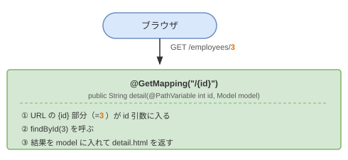

# ch02 詳細表示

## このチャプターで学ぶこと

- URL にパスを含むルーティング（`/employees/3` の仕組み）
- `@PathVariable` で URL の値をメソッド引数に受け取る方法
- `queryForObject` で 1 件だけ取得する方法
- Thymeleaf の `th:if`・Elvis 演算子（`?:`）で条件によって表示を変える方法
- LEFT JOIN で別テーブルのデータと結合して取得する方法

---

## 基礎知識

### `/employees/3` のような URL はどう処理される？

ch01 では `GET /employees` を一覧表示に使いました。  
詳細表示は `GET /employees/3`（ID が 3 の社員）のように、URL に ID を含めます。



### @PathVariable ─ URL の値を引数に受け取る

`@GetMapping("/{id}")` の `{id}` はプレースホルダです。  
`@PathVariable int id` と書くことで、URL に含まれる数値が `id` 変数に自動でセットされます。

```java
@GetMapping("/{id}")
public String detail(@PathVariable int id, Model model) {
    // /employees/3 にアクセスすると id = 3 が入る
    // /employees/10 にアクセスすると id = 10 が入る
}
```

> **ポイント**: `{id}` の名前と `@PathVariable int id` の変数名を一致させる必要があります。

### query と queryForObject の違い

| メソッド | 用途 | 戻り値 |
|---|---|---|
| `query(...)` | 複数件を取得する | `List<T>` |
| `queryForObject(...)` | 1 件だけ取得する | `T`（単一オブジェクト） |

```java
// 一覧（複数件）→ query
List<Employee> employees = jdbcTemplate.query("SELECT ...", ...);

// 詳細（1件）→ queryForObject
Employee employee = jdbcTemplate.queryForObject("SELECT ... WHERE id = :id", ...);
```

> **注意**: `queryForObject` は結果が 0 件や 2 件以上のとき例外が発生します。  
> ID が存在しないケースの対処はこの章の練習問題で扱います。

### LEFT JOIN で別テーブルのデータを取得する

`employees` テーブルには `dept_id` しかなく、部署名（`name`）は `departments` テーブルにあります。  
tokkun-sql で学んだ LEFT JOIN をそのまま使えます。

```sql
-- tokkun-sql で書いた LEFT JOIN と同じ構文
SELECT e.*, d.name AS dept_name
FROM employees e
LEFT JOIN departments d ON e.dept_id = d.id
WHERE e.id = :id
```

Java 側では、`AS dept_name` の別名が `Employee.deptName` フィールドに自動でマッピングされます。

| SQL の結果 | Employee クラスのフィールド |
|---|---|
| `dept_name = 営業部` | `employee.deptName = "営業部"` |

`Employee` クラスにはすでに `deptName` フィールドが定義済みです。

### Thymeleaf の条件表示

#### th:if と th:unless

条件によって要素を表示・非表示にします。

```html
<!-- managerId が null でないとき表示 -->
<span th:if="${employee.managerId != null}" th:text="${employee.managerId}"></span>

<!-- managerId が null のとき表示 -->
<span th:unless="${employee.managerId != null}">（なし）</span>
```

#### Elvis 演算子 `?:` ─ null のときだけ代替値を返す

`null` の場合に別の値を表示したいときは **Elvis 演算子**（`?:`）が便利です。

```html
<!-- managerId が null なら「（なし）」を表示、null でなければ値を表示 -->
<dd th:text="${employee.managerId} ?: '（なし）'"></dd>
```

> **ポイント**: `?:` の左辺が `null` の場合に右辺を返します。  
> tokkun-java で学んだ三項演算子 `condition ? a : b` の「null チェック専用版」です。

---

## スターターコードの確認

現在の状態を確認しましょう。

**動いていること**
- `GET /employees` で社員一覧が表示される（全カラム・入社日降順）
- `GET /employees/3` で詳細画面に遷移できる（ID と氏名のみ表示）

**まだ動いていないこと**
- 詳細画面には ID と氏名しか表示されていない
- 部署名が表示されていない
- 新規登録フォームがない

確認すべきファイル：

```
repository/EmployeeRepository.java   ← findById の SQL を確認
templates/employee/detail.html       ← 表示項目の少なさを確認
```

**`EmployeeRepository.java` の findById（現在の SQL）**

```java
public Employee findById(int id) {
    return jdbcTemplate.queryForObject(
        "SELECT * FROM employees WHERE id = :id",
        Map.of("id", id),
        new BeanPropertyRowMapper<>(Employee.class)
    );
}
```

**`templates/employee/detail.html`（現在の表示項目）**

```html
<dl class="row">
    <dt class="col-sm-2">ID</dt>
    <dd class="col-sm-10" th:text="${employee.id}"></dd>

    <dt class="col-sm-2">氏名</dt>
    <dd class="col-sm-10" th:text="${employee.name}"></dd>
</dl>
```

---

## 練習問題

### 問題 02-1：詳細画面に項目を追加する

**目標**: 詳細画面に「給与」「入社日」「部署 ID」「上司 ID」を追加する。

**編集するファイル**
- `templates/employee/detail.html`

**手順のヒント**

現在の `findById` は `SELECT *` ですでに全カラムを取得しています。  
テンプレートに `<dt>`/`<dd>` を追加するだけで表示できます。

```html
<dt class="col-sm-2">給与</dt>
<dd class="col-sm-10" th:text="${employee.salary}"></dd>
```

追加すべき項目と対応するフィールド名：

| 表示ラベル | フィールド名 |
|---|---|
| 給与 | `employee.salary` |
| 入社日 | `employee.hireDate` |
| 部署 ID | `employee.deptId` |
| 上司 ID | `employee.managerId` |

**確認ポイント**
- 詳細画面に給与・入社日・部署 ID・上司 ID が表示されること
- 上司 ID がいない社員（田中 太郎）の上司 ID が空欄になること

---

### 問題 02-2：上司 ID が未登録の場合に「（なし）」と表示する

**目標**: 上司 ID が `null` の社員は「（なし）」と表示し、空欄を避ける。

**編集するファイル**
- `templates/employee/detail.html`

**手順のヒント**

Elvis 演算子 `?:` を使います。

```html
<!-- null なら「（なし）」、値があればその値を表示 -->
<dd class="col-sm-10" th:text="${employee.managerId} ?: '（なし）'"></dd>
```

**確認ポイント**
- 上司 ID がない社員（田中 太郎・ID=1）の詳細で「（なし）」と表示されること
- 上司 ID がある社員（鈴木 花子・ID=2）の詳細で上司の ID 番号が表示されること

---

### 問題 02-3：部署名を取得するために SQL を変更する

**目標**: `findById` の SQL に `departments` テーブルとの LEFT JOIN を追加し、部署名を取得できるようにする。

**編集するファイル**
- `repository/EmployeeRepository.java`

**手順のヒント**

tokkun-sql で学んだ LEFT JOIN をそのまま使います。

```java
public Employee findById(int id) {
    return jdbcTemplate.queryForObject(
        "SELECT e.*, d.name AS dept_name" +
        " FROM employees e" +
        " LEFT JOIN departments d ON e.dept_id = d.id" +
        " WHERE e.id = :id",
        Map.of("id", id),
        new BeanPropertyRowMapper<>(Employee.class)
    );
}
```

> **ポイント**: `d.name AS dept_name` と別名をつけることで、  
> `Employee` クラスの `deptName` フィールドに自動でマッピングされます。

**確認ポイント**
- ブラウザで詳細画面にアクセスしてエラーが出ないこと
- （まだ HTML に `dept_name` を追加していないので、次の問題まで画面の見た目は変わりません）

---

### 問題 02-4：詳細画面に部署名を表示する

**目標**: 部署 ID ではなく、実際の部署名（「営業部」など）を詳細画面に表示する。

**編集するファイル**
- `templates/employee/detail.html`

**手順のヒント**

問題 02-3 で `deptName` を取得できるようになりました。  
あとはテンプレートに追加するだけです。

```html
<dt class="col-sm-2">部署名</dt>
<dd class="col-sm-10" th:text="${employee.deptName} ?: '（未所属）'"></dd>
```

> **ポイント**: `dept_id` が `null` の社員は `deptName` も `null` になるため、  
> Elvis 演算子で「（未所属）」と表示するとよいです。

**確認ポイント**
- 詳細画面に「営業部」「開発部」などの部署名が表示されること
- 部署が未登録の社員がいる場合、「（未所属）」と表示されること

---

### 問題 02-5：新規登録フォームの土台を作る

**目標**: `GET /employees/new` にアクセスすると氏名と給与を入力できるフォームが表示されるようにする。

この問題は複数ファイルを変更します。フォームの **送信（POST）** は次章で実装します。

**編集・追加するファイル**
- `controller/EmployeeController.java`（`createForm` メソッドを追加）
- `templates/employee/create.html`（新規作成）
- `templates/employee/index.html`（「新規登録」リンクを追加）

#### ステップ 1：Controller に createForm アクションを追加する

```java
// controller/EmployeeController.java に追加

@GetMapping("/new")
public String createForm(Model model) {
    model.addAttribute("employee", new Employee());
    return "employee/create";
}
```

> **ポイント**: `new Employee()` は空の社員オブジェクトです。  
> フォームの初期値として渡します（入力値は全て空の状態）。

> **注意**: `@GetMapping("/{id}")` より **前に** このメソッドを書くこと。  
> Spring MVC はメソッドの定義順に URL を照合するため、  
> `/{id}` が先にあると `/new` が `id = "new"` と誤って解釈される場合があります。

#### ステップ 2：create.html を新規作成する

`templates/employee/` に `create.html` を新規作成してください。

```html
<!DOCTYPE html>
<html xmlns:th="http://www.thymeleaf.org"
      xmlns:layout="http://www.ultraq.net.nz/thymeleaf/layout"
      layout:decorate="~{layout/default}">
<head>
    <title>社員登録</title>
</head>
<body>
<div layout:fragment="content">
    <h1>社員登録</h1>

    <form th:action="@{/employees}" method="post">
        <div class="mb-3">
            <label class="form-label">氏名</label>
            <input type="text" name="name" class="form-control" />
        </div>
        <div class="mb-3">
            <label class="form-label">給与</label>
            <input type="number" name="salary" class="form-control" />
        </div>
        <button type="submit" class="btn btn-primary">登録</button>
        <a th:href="@{/employees}" class="btn btn-secondary">キャンセル</a>
    </form>
</div>
</body>
</html>
```

> **現時点の制限**: フォームを送信（POST）すると 405 エラーになります。  
> POST の処理は ch03 で実装します。

#### ステップ 3：index.html に「新規登録」リンクを追加する

```html
<!-- h1 の下・件数表示の上に追加 -->
<a th:href="@{/employees/new}" class="btn btn-primary mb-3">新規登録</a>
```

**確認ポイント**
- `http://localhost:8080/employees/new` にアクセスするとフォームが表示されること
- 「キャンセル」をクリックすると一覧に戻ること
- 一覧画面に「新規登録」ボタンが表示されること
